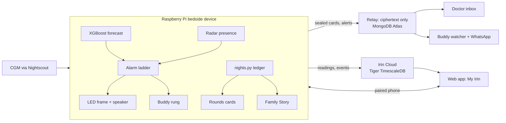

# Irin

**A bedside guardian for people with type 1 diabetes, so a low blood sugar at night never goes unanswered.**

Irin is a Raspberry Pi bedside device that shows live glucose, **predicts lows 30 minutes ahead with machine learning**, and wakes the sleeper with an LED frame and escalating sound. Around that device we built the rest of the safety net: short, encrypted **Clinical Signal Cards** for the patient's own doctor, a **Night Buddy** on the other side of the world who is awake while you sleep, and a plain-language **Family Story** of the night for the people who love you.

One system, three audiences: **you, your doctor, and your people.**

| | |
|---|---|
| Track | **AI / ML / Data Visualization** |
| Sponsor challenges | **Impiricus** (Irin Rounds) · **Meta** (Night Buddy + Family Story) |
| Web app | https://irin-out-of-sleep-at-hackgt.tech |
| Doctor inbox | https://doctor.irin-out-of-sleep-at-hackgt.tech |
| Buddy watcher | https://watch.irin-out-of-sleep-at-hackgt.tech |
| Family page | https://family.irin-out-of-sleep-at-hackgt.tech |

---

## Why

One of us, Chris, has type 1 diabetes. **"Dead-in-bed syndrome"** is the name for the worst case: a young person with type 1 goes to sleep and doesn't wake up, most often after a severe low blood sugar overnight. A continuous glucose monitor (CGM) can alarm, but a phone on a nightstand is easy to sleep through, and many people with diabetes live alone, with no one there to wake them.

Irin gives the night three layers: a prediction that comes **before** the low, a room that **wakes you**, and a **human** who is told when you don't answer.

---

## One system, three audiences

Irin is not three hacks stapled together. The bedside device is the spine (forecast, alarm ladder, presence, relay, narrative-with-validator), and each audience is a door into the same house.

| Audience | Part | What it does | Challenge |
|---|---|---|---|
| **The sleeper** | **Irin** (the device + the app) | Live glucose, a 30-minute low forecast, LED + sound alarm ladder, phone acknowledge, morning report | Main judging · AI/ML/Data Viz track |
| **The doctor** | **Irin Rounds** | Decision-ready Clinical Signal Cards built from real nights, encrypted to the doctor's key, read in a clinician inbox; a doctor's reply applies only after the patient confirms | **Impiricus** |
| **The people who care** | **Night Buddy** + **Family Story** | A matched buddy as the last human rung on the alarm ladder, an opt-in volunteer hub, and a plain-language story of the night for family, with a voice note | **Meta** |

### How the track and the sponsor challenges connect

- **AI / ML / Data Visualization (the track)** runs through all three parts: the XGBoost forecaster drives the alarm; `nights.py` turns raw CGM into night records that every card is built from; language models write the words (never the decisions) behind a number-checking validator; and the data is drawn on the kiosk, in the My Irin dashboards, on the doctor's cards, and on the buddy globe.
- **Impiricus → Irin Rounds.** The same night records the alarm produces become Standing Cards (Basal Check, Hypo Response, Follow-up) and Step Watch cards (the weeks after a GLP-1 or weekly-basal start). Every number is computed by code and labeled *measured*, *reported*, or *inferred*. A blind relay ("mock Impiricus") carries only ciphertext to the inbox ("mock Ascend"), and a "What Impiricus sees" panel proves it.
- **Meta → Night Buddy + Family Story.** **Muse Spark** (through the Meta Model API) writes the buddy introductions and why-this-match lines, the buddy's morning and close-out lines, and the Family Story. **WhatsApp** (Graph API) is the buddy alert's second channel. The matching itself stays deterministic code.

---

## What it does

### Irin, the bedside device
- **Live glucose** from Nightscout (a real CGM) or a replay scenario for demos, always badged **DEMO** when replayed.
- **30-minute low forecast** (XGBoost) drawn as a dotted line on the kiosk graph; a predicted low sounds a warning **before** the actual low.
- **Alarm ladder:** LED frame + distinct tones by tier, escalating if unanswered; low alarms always sound, whatever the quiet hours.
- **Presence radar** knows if someone is in bed. Away mode dims the room outputs only; it never touches alarm logic.
- **Phone app:** pair your phone to the device with a 6-digit code or QR, see live data, acknowledge from bed, log insulin and carbs (typed or by voice, always echoed back for confirmation), and switch the kiosk between live and night view.
- **Morning report** in plain language, and a morning screen with last night's time in range.
- **Works with no internet:** everything that keeps you safe runs on the Pi.

### Irin Rounds (Impiricus)
- **Standing Cards** for ordinary months: Basal Check (clean nights only, every excluded night listed with its reason), Hypo Response, and Follow-up after a confirmed dose change.
- **Step Watch** for titration weeks: early check, step checks, step gates, graduation, and step-week vigilance.
- **A strict noise budget** (one place, `noise.py`): one Standing Card per type per 14 days, green goes to a weekly digest, red bypasses everything but is deduplicated.
- **Share with doctor** from the app: a QR, a 4-digit code match, and a fresh-PIN confirm. The doctor's key is made in the doctor's own browser.
- **Doctor replies** (plan, hold, note) never apply without the patient's echo-and-confirm.
- **Brain versus Bedside:** the same card with and without the bedside device, side by side; rows change confidence label, never go blank.
- **Morning recall** questions ("did you feel that low?") feed the unfelt-low rate.

### Night Buddy + Family Story (Meta)
- **Find me a buddy:** a guided wizard (about you, your languages, your time zone), then a **spinnable globe** to pick where your buddy should be, your available hours, opt-ins, and your emergency script.
- **Mutual matching:** you're only offered people who picked your time zone; the score favors someone awake during your night, a mirror time zone, and shared languages. Muse writes the introduction and the why-this-match line.
- **The buddy rung:** 10 minutes into an unanswered low, if the radar sees you in bed, your buddy's phone loops an ElevenLabs voice alert and gets a WhatsApp message. It never contains a glucose value, a location, or contact details; the call is brokered. A buddy claim never pauses your own alarms.
- **The hub:** opt in to volunteer, see people who are low right now and speak your language, claim one, follow their own pre-written script. Device-confirmed and unconfirmed listings look different.
- **Family Story:** a plain-language story of the night at a disclosure level the patient controls, emailed with a 20-second voice note. A story-only recipient never sees a glucose value, and a no-data night is never told as "fine".

---

## AI, ML, and data visualization

### Machine learning: the low forecaster
An **XGBoost** regressor predicts glucose **30 minutes ahead** from the last 60 minutes of CGM (13 five-minute slots, gaps left missing, never interpolated). It's deliberately cautious, a 20th-percentile forecast ("how low could it plausibly get"), and it ships as a small JSON model that runs on the Pi with no internet. Headline, from `ml/models/metrics.md`:

> Over 5 out-of-sample 8-week blocks of one person's real CGM history (24 overnight lows, about 276 sensor-nights), the forecaster warned **10–60 min ahead of 75% of overnight lows (18 of 24)**, with a **median lead of 27.5 min**, at **0.20 false alarms per night**. A plain 15-minute trend line catches about the same share but raises **0.47 false alarms per night**, more than twice as many. Scored by replaying every reading through the device's own warning rule. n = 1 person, retrospective; treat 75% as an upper estimate.

**Rounds, retrospectively:** on one confirmed basal increase in the same history, Basal Check would have flagged rising overnight glucose at least 2 weeks before the change on 69% of mornings, against a 14% background rate in stable stretches (observational, n = 1).

### Night classification
`ml/models/nights.py` is the one shared module that scores every night: sensor coverage, overnight and dawn rise, low point, time below range, near-misses, and reason codes. No card draws a conclusion from a night under 85% coverage or a window under 70%.

### Language models: words, never decisions
Every model-written sentence goes through one chain (`backend/app/rounds/narrative.py`) under a single 20-second deadline:

| Task | Model |
|---|---|
| Doctor card narrative, morning report | **Claude** (Anthropic) |
| Second opinion on each card | a different provider (OpenAI) via **Backboard**; disagreement ships the template |
| Buddy introduction, why-this-match, buddy lines, Family Story | **Muse Spark** (Meta Model API) |
| Fallback for all of the above | a deterministic template |

A **validator** rejects any answer containing a number the code didn't supply (with sign checks, a dose guard on cards, and no glucose thresholds in buddy text). **Backboard** also provides memory, read-only for family scopes.

### Voice
- **ElevenLabs** renders the buddy alert voice (looped on the buddy's phone and attached to WhatsApp) and the Family Story voice note; clips are cached by text so nothing is rendered twice.
- **Voice logging** uses the phone browser's speech recognition; the Pi parses the text with plain rules and always echoes insulin back for confirmation.

### Data visualization
| Where | What |
|---|---|
| **Kiosk** | Big live number, trend arrow, 3-hour graph with the forecast as a dotted line, night clock, morning screen; the **LED frame** colour mirrors glucose |
| **My Irin** | 11 charts over **Tiger Cloud (TimescaleDB)** continuous aggregates: time in range, overnight patterns, alarms, Step Watch, buddy activity. Dashboards draw pictures and never decide; `ml/tests/test_agreement.py` checks they agree with `nights.py` |
| **Doctor inbox** | Clinical Signal Cards with a confidence label on every number, a night replay, and the "What Impiricus sees" panel |
| **Irin Rounds tab** | Brain versus Bedside cards side by side |
| **Buddy globe** | A spinnable orthographic globe (d3-geo + world-atlas) with each zone's city and current local time |

---

## Hardware

| Part | Role |
|---|---|
| **Raspberry Pi 5** | Runs the whole backend locally (Python 3.14 via uv, aarch64) |
| **Raspberry Pi touch display** (DSI) | The kiosk: glance, alarm takeover, touch PIN keypad |
| **WS2812B LED frame** (29 LEDs) | The visual alarm; colour mirrors glucose |
| **SN74AHCT125N level shifter** + 330 Ω resistor | Lifts the Pi's 3.3 V LED data to 5 V |
| **ALITOVE 5 V 5 A supply** + 1000 µF capacitor | Powers the LEDs. **The strip's 5 V never comes from the Pi.** |
| **HLK-LD2410B-P mmWave radar** | Presence: is someone in bed? (GPIO17, 3.3 V logic) |
| **USB speaker** | Alarm tones, voice echoes, the buddy chime |

Key wiring (full map and the as-built table in [`hardware/docs/wiring.md`](hardware/docs/wiring.md)):

- LED data: Pi GPIO10 / SPI MOSI (pin 19) → shifter 1A → 1Y → 330 Ω → frame DIN; common ground between the Pi, shifter, and LED supply.
- Radar: VCC → 5 V, GND → ground, OUT → GPIO17 (pin 11). Range set to 1.5 m for the venue table.
- On the Pi 5, LEDs are driven over SPI (RPi.GPIO and rpi_ws281x do not work on the Pi 5); GPIO uses gpiozero with the lgpio backend.
- The hardware layer is behind one interface, `hardware/hal.py`, with a mock (`IRIN_HW=mock`) so everything runs on a laptop.
- The Pi has no RTC battery, so wall-clock jobs wait for NTP; staleness is measured on a monotonic clock. The backend runs as a systemd user service, never as root.

---

## Tech stack

| Layer | Stack |
|---|---|
| **Device backend** (`backend/`) | Python 3.14, FastAPI, Uvicorn, SQLite, Pydantic, XGBoost, NumPy, PyNaCl (crypto_box), httpx, matplotlib, qrcode |
| **ML** (`ml/`) | XGBoost (JSON model, never a pickle), pandas/scikit-learn for training only (never on the Pi) |
| **Hardware** (`hardware/`) | gpiozero + lgpio, SPI NeoPixel driver, a mock HAL |
| **Relay** (`relay/`, "mock Impiricus") | FastAPI + **MongoDB Atlas**; ciphertext and profile fields only, never a glucose value; also the buddy directory, hub, and WhatsApp channel |
| **Irin Cloud** (`cloud/`) | FastAPI + psycopg on **Tiger Cloud (TimescaleDB)** hypertables and continuous aggregates; ElevenLabs rendering |
| **Web app** (`frontend/app/`) | Vite + React + TypeScript + Tailwind; d3-geo, topojson-client, world-atlas for the globe; the built `dist/` is committed |
| **Kiosk + role pages** (`frontend/display/`, `clinician/`, `watch/`, `family/`) | Plain HTML/CSS/JS, no build step |
| **AI services** | Anthropic Claude, Meta Model API (Muse Spark), Backboard, OpenAI (second opinion), ElevenLabs, WhatsApp Graph API |
| **Hosting** | One Vultr VPS running Caddy, the relay, and the cloud from `deploy/docker-compose.yml`; the Pi reached through a Cloudflare tunnel |

### Architecture



---

## Safety rules we never weaken

A few of the invariants every part of the code obeys (the full list is in [`CLAUDE.md`](CLAUDE.md)):

- Stale data is always shown as stale and never forecast on; replayed data is always badged **DEMO**.
- Insulin is never stored without echo-and-confirm. Low alarms always sound.
- Cards never contain dose recommendations; doctors type every number. Every number on a card carries a confidence label, and any invented number in generated text falls back to the template.
- Irin never changes a plan or dose by itself; a doctor's message applies only after the patient confirms.
- Patient data leaves the device only encrypted to the paired doctor's key; the relay stores ciphertext only.
- The buddy and hub rungs are additive only: they never delay, quiet, or gate a local alarm. No glucose value, location, or contact appears on the hub or in a buddy alert.
- Every state-changing endpoint sits behind the PIN; pairing confirmations re-prompt for a fresh PIN.

---

## Try it locally

```bash
git clone <this repo> irin && cd irin
cp .env.example .env                       # placeholders are fine for the mock backend
uv venv --python 3.14 .venv && source .venv/bin/activate
uv pip install -r backend/requirements.txt
cd backend && IRIN_HW=mock uvicorn app.main:app --reload
# open http://localhost:8000/  (the kiosk display page, replay data, DEMO badge)
```

The web app (Node 22):

```bash
cd frontend/app && npm install && npm run dev   # http://localhost:5173
```

Optional: the relay (`uvicorn main:app --port 8100 --reload` from `relay/`), Irin Cloud (`--port 8200` from `cloud/`), or everything plus Caddy and local databases with `docker compose -f deploy/docker-compose.yml up`.

Tests: `cd backend && IRIN_HW=mock pytest -q`, and `pytest -q` from `relay/`, `cloud/`, `ml/`, and `hardware/`.

### Demo scenarios
`demo/scenarios/` holds date-shifted replay nights (and SYNTHETIC ones, clearly labeled): **The Save** (a predicted low caught before it happens), a normal night, a re-armed low, a high spike, a sensor failure, a basal change, and a synthetic GLP-1 titration. The app's demo panel plays them at 1× to 240×, seeks to any day, and shows Brain versus Bedside.

---

## Repository layout

| Path | What |
|---|---|
| `backend/` | The Pi's FastAPI service: alarm, forecast, presence, ledger, `rounds/`, `buddy/`, owner pairing, forwarder |
| `ml/` | Training, evaluation, the forecaster model, and `nights.py` |
| `hardware/` | The HAL, LEDs, sound, presence, and the wiring docs |
| `relay/` | The blind courier: cards, messages, pairing, hub, buddy directory, WhatsApp |
| `cloud/` | Irin Cloud: ingest, dashboards, family rollup, audio rendering; `cloud/sql/` holds the Tiger aggregates |
| `frontend/` | `app/` (the four-tab web app), `display/` (the kiosk), `clinician/`, `watch/`, `family/` |
| `deploy/` | Docker Compose, Caddy, the Pi install and gate scripts, auto-deploy |
| `demo/` | Replay scenarios and their companions |
| `docs/` | The specs and per-lane build plans |
| `journal/` | The team's running build log |

---

## Honest notes

- The forecaster and Rounds numbers are from **one person's** history, retrospective (n = 1).
- Standing Cards run on Chris's real history: **glucose real; reason codes inferred and labeled; acknowledge, presence, and recall data are a labeled overlay.**
- The buddy directory includes **sample profiles** (usernames ending in `_sample`, badged "Sample profile") so matching and the hub can be shown; they are not real people.
- "Mock Impiricus" and "mock Ascend" stand in for the sponsors' real systems; no patient data is shared with any manufacturer.

---

## Team

- **Chris Guzman:** backend, relay, cloud, and the shared infrastructure
- **Justin:** frontend: the web app, the kiosk, and the role pages
- **George:** ML: the forecaster, `nights.py`, and the Tiger Cloud aggregates
- **Slavik:** hardware and the demo video

Built at HackGT.
